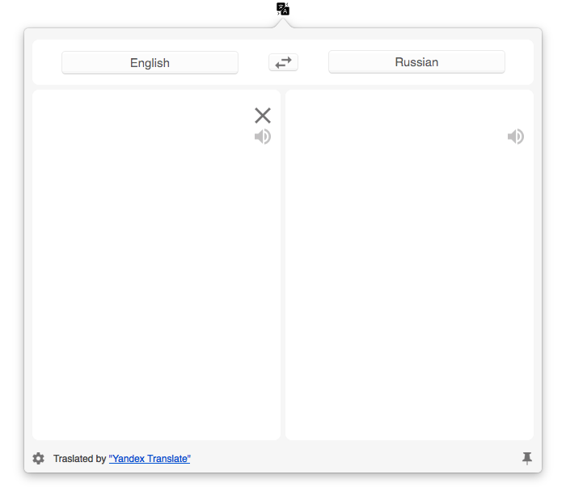
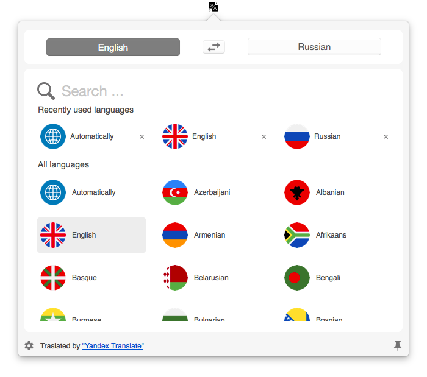

## MenuBarTranslator

MenuBarTranslator is an app that allows to translate text directly from your menu bar.

Application is translating and pronouncing text via Yandex API Services.

It is written in Swift 4 without any external libraries.

Pronounciation is working **only** for: 
* English
* Russian
* Turkish
* Urkanian

